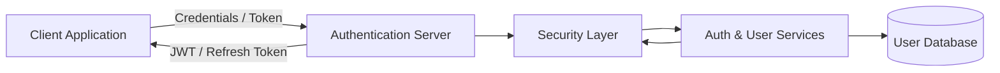
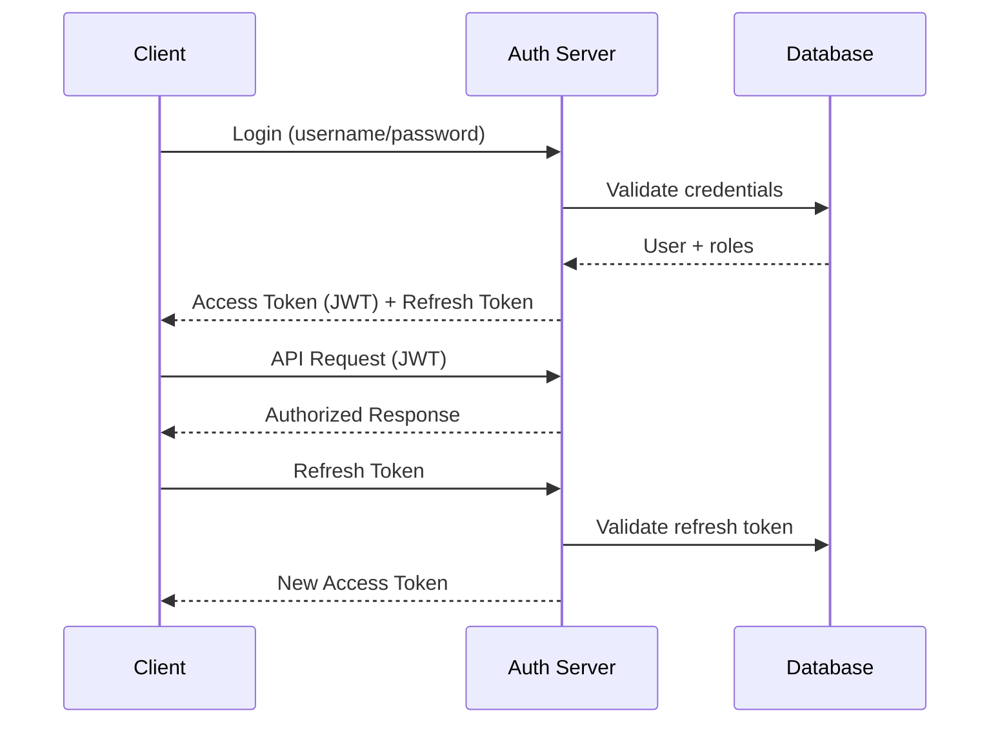
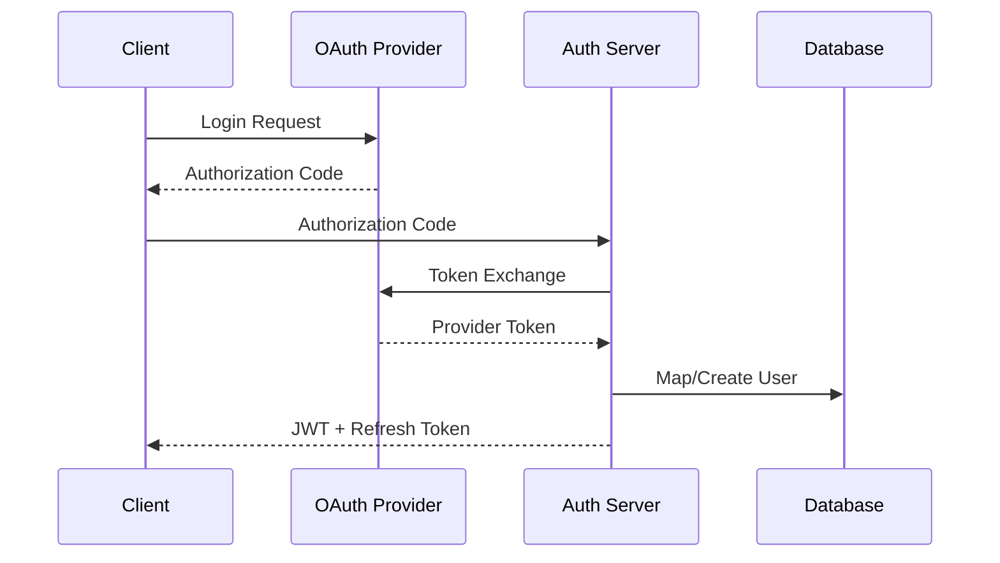

# Authentication & User Management Server (Spring Boot)

A modular authentication and user management server built with Spring Boot, supporting **Basic Authentication**, *
*JWT-based authentication**, **social login (OAuth2)**, and **role-based authorization**.  
The system is designed as a reusable backend service for securing distributed applications.

---

## Overview

This project implements a centralized authentication server intended to be used by multiple client applications.  
The primary focus is on **security**, **extensibility**, and **clean separation of concerns** rather than UI features.

Key objectives:

- Support multiple authentication mechanisms
- Provide stateless authentication using JWT
- Enable secure user and role management
- Demonstrate real-world security trade-offs and design decisions

---

## Supported Authentication Mechanisms

### 1. Basic Authentication

- Used for legacy systems, internal services, or initial credential exchange
- Credentials are verified against a database-backed user store
- Restricted to HTTPS-only usage

### 2. JWT-Based Authentication

- Stateless access tokens
- Signed tokens with configurable expiration
- Role and permission claims embedded in tokens
- Designed for horizontal scalability (no server-side session storage)

### 3. Refresh Token Flow

- Short-lived access tokens
- Long-lived refresh tokens
- Refresh tokens stored and validated server-side
- Supports token rotation and revocation

### 4. Social Login (OAuth2)

- Third-party identity providers (e.g., Google, GitHub)
- OAuth2 authorization code flow
- External identities mapped to internal user accounts
- Local roles and permissions remain under server control

---

## User & Role Management

- User registration and account lifecycle management
- Role-based access control (RBAC)
- Fine-grained authorization at the endpoint and service levels
- Clear distinction between authentication and authorization logic

---

## Architecture

The authentication server follows a **layered, modular architecture** designed to support multiple authentication
mechanisms while maintaining clear security boundaries and separation of concerns.

---

### Request Flow Overview

1. **Client Request**
    - Client authenticates using Basic Auth, JWT, or OAuth2 provider.

2. **Security Layer**
    - Incoming requests pass through Spring Security filters.
    - Authentication mechanism is selected based on request context.
    - JWTs are validated and parsed without server-side session state.

3. **Service Layer**
    - Authentication and authorization logic is executed.
    - Token issuance, refresh, and revocation are handled here.
    - User roles and permissions are resolved.

4. **Persistence Layer**
    - User accounts, roles, and refresh tokens are stored and retrieved.
    - Database access is isolated behind repository interfaces.

---

### Authentication Mechanism Isolation

Each authentication mechanism is implemented in a way that minimizes coupling:

- **Basic Authentication**
    - Used for credential verification and legacy clients
    - Delegates user validation to the service layer

- **JWT Authentication**
    - Stateless token verification
    - Authorization decisions derived from token claims

- **OAuth2 / Social Login**
    - External identity providers handled separately
    - External identities mapped to internal user accounts
    - Internal authorization remains fully controlled by this server

This design allows new authentication mechanisms to be added without affecting existing flows.

---

### Design Principles

- **Statelessness**
    - Access tokens are stateless to allow horizontal scaling.
- **Explicit Trust Boundaries**
    - Authentication, authorization, and persistence are clearly separated.
- **Extensibility**
    - New providers, roles, or token strategies can be added with minimal changes.
- **Security First**
    - Sensitive logic isolated in the security and service layers.
    - No business logic embedded in controllers.

---

### Intended Deployment Model

The server is designed to operate as:

- A standalone authentication service
- A shared identity provider for multiple applications
- A backend component in a microservices or distributed system architecture

---

---

### OAuth2 / Social Login Flow Diagram

